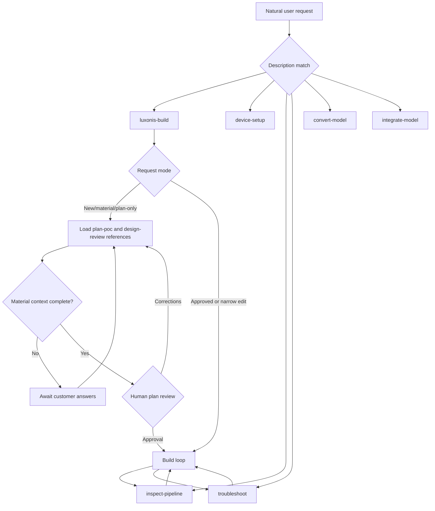

# V2 Lightweight architecture

## Invocation

The host initially sees skill names and descriptions. It loads a full `SKILL.md` only after the
user or model selects that skill. Every skill permits implicit invocation, but descriptions are
narrow enough to separate building, setup, inspection, troubleshooting, conversion, and
integration.

Specialist transitions are model-mediated, not a deterministic function call. Critical plan,
approval, evidence, and completion rules remain in `luxonis-build`; specialists provide focused
procedures and also work independently.

## Progressive disclosure

- Skill metadata is always available for selection.
- `luxonis-build/SKILL.md` contains only request routing, approval, the vertical-slice loop,
  completion, and guardrails.
- Planning, camera-design review, current-context fallback, and final-output verification load only
  when the current mode needs them.
- Version-sensitive facts come from Luxonis MCP, exact current examples/docs, and installed help.

## Evidence contracts

| Artifact | Role |
| --- | --- |
| `POC_PLAN.md` | Reviewed use case, assumptions, topology, graph, risk test, and acceptance. |
| `DEVICE.md` | Verified target identity, environment, run path, and direct readiness observation. |
| `MODEL_CONVERSION.md` | Immutable source/model contract, conversion, archive, and validation. |
| `evidence/` | Bounded frames, messages, commands, and observations supporting runtime claims. |
| `POC_REPORT.md` | Repeatable working-demo command, passing evidence, limitations, and handoff. |

`POC_PLAN.md` is required only for a new POC or material redesign. Standalone specialists use
available artifacts but do not require the complete sequence.
