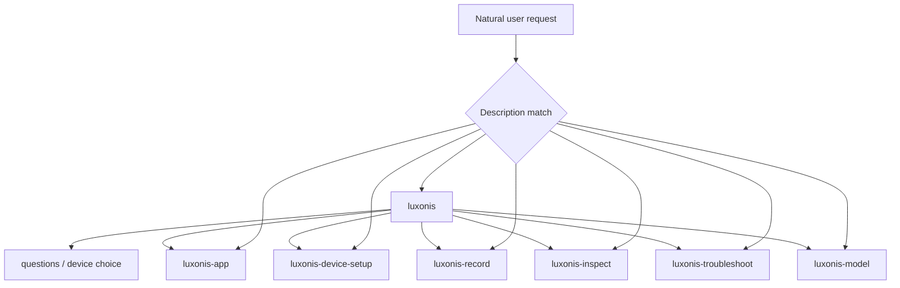

# Companion architecture

Experimental. The customer-facing product story lives in the [README](../README.md).

## Invocation

The host sees skill names and short job-shaped descriptions. It loads a `SKILL.md` after the
user or model selects that skill. All seven skills allow implicit invocation. Manual trigger
of `luxonis` is the contract; auto-invoke is useful gravy.

`luxonis` is the entry skill: confirm MCP, then do the asked job (questions, device choice,
setup, or hand off application work). An app in the folder is not required.

Specialist transitions are by naming the sibling skill. Do not copy a specialist's procedure
into another skill.

## Artifacts that survive a new chat

| Artifact | Role |
| --- | --- |
| `DEVICE.md` | Setup notes for later sessions. May list several units. Always a hint; trust live state. |
| `PROJECT_BRIEF.md` | Living business problem when the job is a product. Owned with `luxonis-app`. Not required for questions or setup. |
| `POC_PLAN.md` | Implementation plan for app work: approach, pipeline diagram, UI/output mockup, recording, validation. |
| The code | The implementation, when there is an application. |
| `recordings/` | Holistic source recordings owned with `luxonis-record`. |

`evidence/` may be a working directory for inspect and replay claims. Next session does not
depend on it.

## Progressive disclosure

- Skill metadata is always available for selection.
- `SKILL.md` is the always-needed procedure.
- `references/` exist only for branches not used every run (inspect instrumentation, model
  convert vs integrate).
- Version-sensitive facts come from MCP tool `luxonis__code` at `https://mcp.luxonis.com/mcp`.
  Fallback: `https://docs.luxonis.com/llms.txt`, installed CLI `--help`, optional cache under
  `~/.luxonis/agent-context/`.
