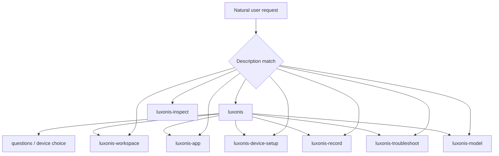

# Companion architecture

Experimental. The customer-facing product story lives in the [README](../README.md).
This file is companion architecture for this skills repo, not the customer project's `docs/`
layout.

## Invocation

The host sees skill names and short job-shaped descriptions. It loads a `SKILL.md` after the
user or model selects that skill. All eight skills allow implicit invocation. Auto-invoke of
`luxonis` for unknown OAK language is the contract, not gravy.

`luxonis` is the entry skill: confirm MCP, gate on workspace, then do the asked job
(questions, device choice, or hand off a named specialist job). An app in the folder is not
required. `luxonis-inspect` is a proof tool; it is not on the entry job list.

Specialist transitions are by naming the sibling skill. Do not copy a specialist's procedure
into another skill.

`luxonis-workspace` is the prerequisite when `AGENTS.md` is missing, or oakctl is missing and
the job needs the host toolchain. Then continue the original job.

oakctl is the host toolchain. Prefer `oakctl run-script` when installed `--help` lists it as
a local DepthAI environment runner. Confirm the subcommand on the host; do not invent names.

## Customer project files

Skills write into the **user's** repo. Living files overwrite in place; dated plans rot.

| Artifact | Kind | Role |
| --- | --- | --- |
| `AGENTS.md` | living | Always-on invariants and pointers. Owned with `luxonis-workspace`. |
| `CLAUDE.md` | living | Includes `@AGENTS.md`; does not duplicate those rules. |
| `docs/glossary.md` | living | Vocabulary. Owned with `luxonis-workspace`. |
| `docs/brief.md` | living | Business problem. Owned with `luxonis-app`. |
| `docs/device.md` | living | Setup notes. Always a hint; trust live state. Owned with `luxonis-device-setup`. |
| `docs/plans/YYYY-MM-DD-<slug>.md` | dated | Implementation plan for product app work. |
| `docs/plans/current.md` | dated pointer | Stub pointing at the current plan. Always update when writing a new plan. |
| The code | living | The implementation, when there is an application. |
| `recordings/` | living | Holistic source recordings owned with `luxonis-record`. Stay out of `docs/`. |

`evidence/` may be a working directory for inspect and replay claims. Stay out of `docs/`.
Next session does not depend on it.

Read legacy root `PROJECT_BRIEF.md`, `POC_PLAN.md`, and `DEVICE.md` if present; write the new
paths. Do not require the user to rename by hand.

## Progressive disclosure

- Skill metadata is always available for selection.
- `SKILL.md` is the always-needed procedure.
- `references/` exist only for branches not used every run (inspect instrumentation, model
  convert vs integrate).
- Version-sensitive facts come from MCP tool `luxonis__code` at `https://mcp.luxonis.com/mcp`.
  Fallback: `https://docs.luxonis.com/llms.txt`, installed CLI `--help`.
