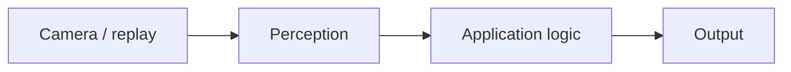

<!-- Write this file to docs/plans/YYYY-MM-DD-<slug>.md. Also update docs/plans/current.md to point here. Plans rot; follow current.md. -->

# Plan: <short title>

- Date: YYYY-MM-DD
- Status: Draft / Ready to implement
- Brief: `docs/brief.md`
- This file: `docs/plans/YYYY-MM-DD-<slug>.md`

## First demo

- We will prove:
- Deferred:

## Approach

- Starting DepthAI v3 example:
- Method (deterministic / Zoo model / customer model):
- Host-connected or standalone:
- Important deltas from the example:

## Pipeline



## UI / output mockup

What the user or downstream system sees (overlay layout, sample JSON, or terminal).

```text
<overlay / JSON / terminal>
```

## Recording

- Path:
- Scene it must contain:
- Still needed from the user:

## Validation

| Check | How (replay / inspect / output) | Passes when |
| --- | --- | --- |

## Assumptions
