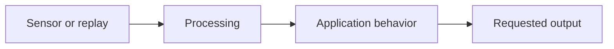

# OAK Proof-of-Concept Plan

- **Status:** Awaiting review / Approved
- **Revision:**
- **Created:**
- **Approved by/date/text:**

Use `Not yet resolved` only for a non-blocking unknown with a validation step. Do not mark this
plan awaiting review while a Must-ask customer decision remains.

## Use-case interpretation

- Real-world goal:
- Primary behavior:
- Targets, events, measurements, or text:
- Requested output and consumer:
- First-demo boundary:
- Deferred work:

## Known facts, customer answers, and assumptions

| Item | Value | Evidence or validation step |
| --- | --- | --- |

## Device and runtime topology

- Target OAK/RVC family:
- Host-connected, OAK App, HostNode, or external-host placement:
- Relevant environment/version constraints:

## Representative input

- Fixture/media path or capture procedure:
- Scene geometry, motion, lighting, and difficult cases:

## Selected starting point

- Current example/source revision:
- Important deltas from the requested application:
- Model or deterministic method:
- Model provenance/license/target compatibility:

## Pipeline

## Material design decisions

- Imaging and sensor output:
- Depth or geometry:
- Crop, resize, preprocessing, and coordinate mapping:
- Tracking, synchronization, queues, and state:
- Device/host compute and data movement:
- FPS, latency, bandwidth, and bottleneck hypothesis:

## Baseline and early risk test

- Known-good baseline command and observation:
- Highest-risk supported assumption:
- Smallest test and passing observation:

## Inspection and final-output contract

| Stage | Topic/output | Evidence command or method | Passing observation |
| --- | --- | --- | --- |

## Working-demo checks

1.

## Human-provided components and open decisions

- Required artifact/interface:
- Owner:
- What the agent can complete before it arrives:

## Review notes

- Consequential tradeoffs:
- Requested corrections:
